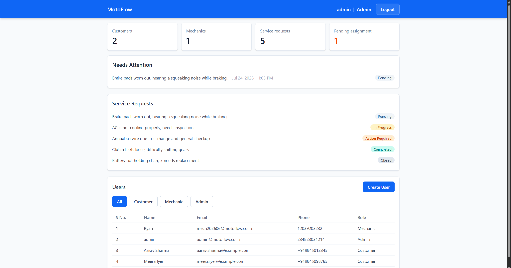
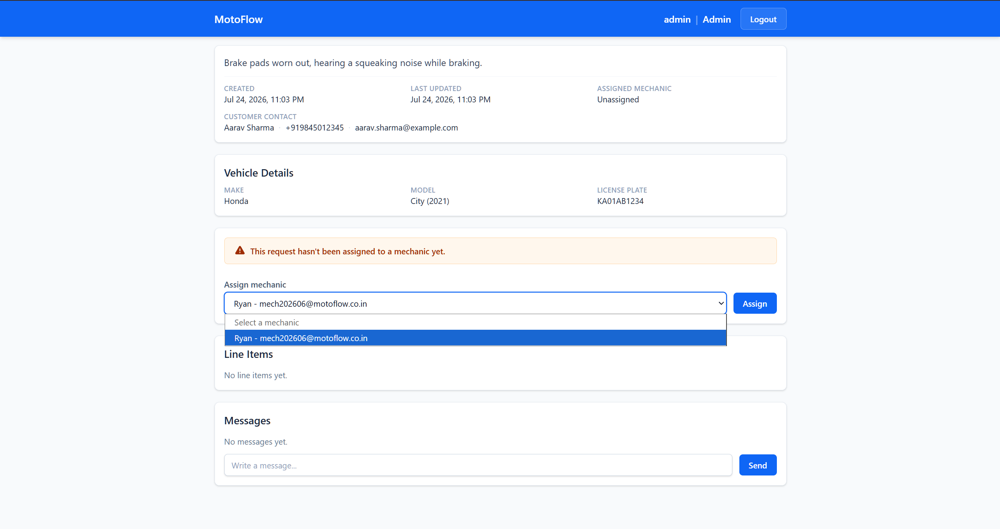
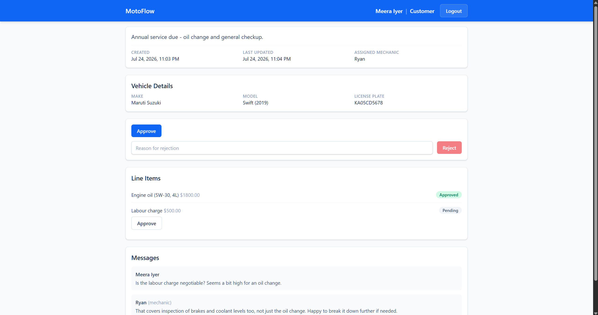
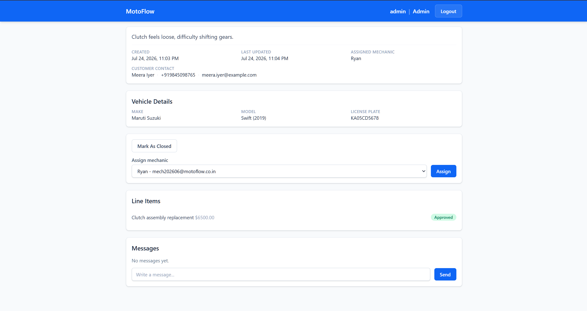
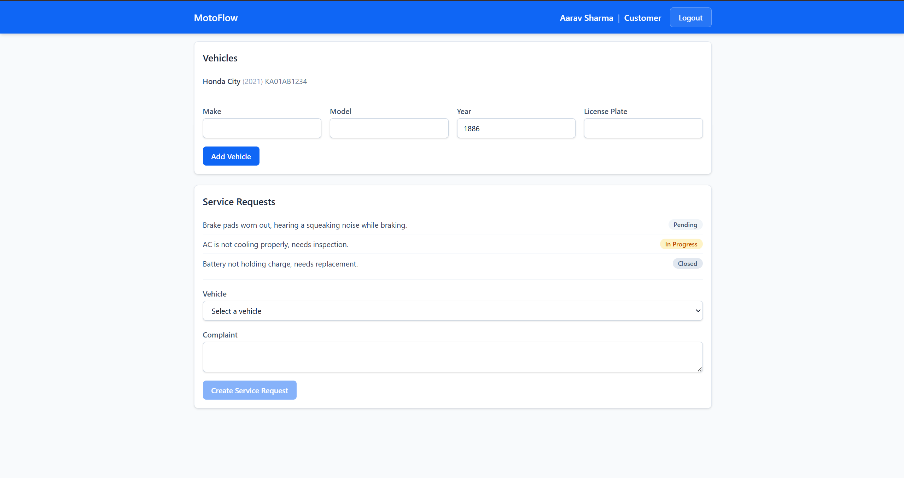
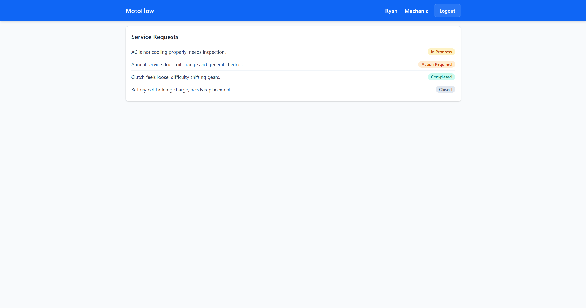
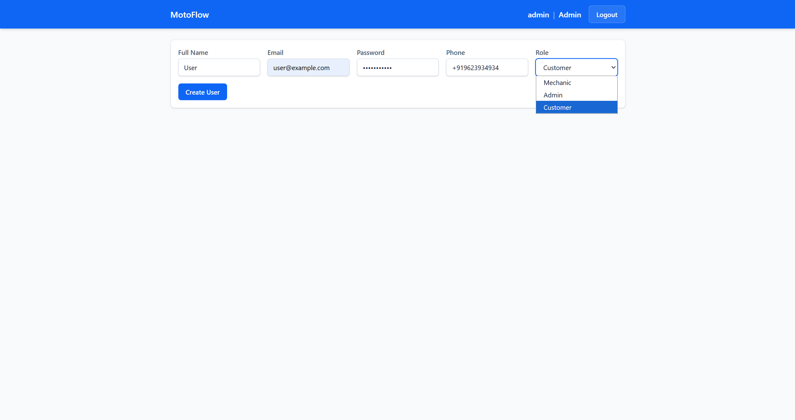

# MotoFlow

A workflow management system for auto repair shops — connects **Customers**, **Mechanics**, and **Admins** on one platform, from booking a service request through cost approval to completion.

## Why

Most small repair shops track jobs through phone calls, paper tickets, or a group chat — there's no single source of truth for "what's the status of my car," "which mechanic is on this job," or "did the customer actually approve this cost.". MotoFlow has brought the service lifecyle as a state machine so user's know the truth with a digital evidence.

## Core design: the service request state machine

Every service request moves through a strict, server-enforced sequence:

```
PENDING → ASSIGNED → IN_PROGRESS → ACTION_REQUIRED → APPROVED → COMPLETED → CLOSED
                          ↑              │
                          └── reject ────┘
                          ↑                             │
                          └──────────── reopen ─────────┘
```

- A request can't skip states — `IN_PROGRESS` can only ever move to `ACTION_REQUIRED`, never directly to `APPROVED` or `COMPLETED`, so a mechanic or admin can never push a job to completion without the customer's sign-off.
- Two tier cost approval: each and every line item must be approved by the customer before the request as a whole can be approved — the backend blocks the request-level approval otherwise.
- A customer can reject work awaiting for their approval for dispute resolution with a required note, which reopens it (`ACTION_REQUIRED → IN_PROGRESS`) and atomically logs the reason as a comment on the thread.
- Even after approval, a mechanic/admin can reopen a request (`APPROVED → IN_PROGRESS`, e.g. if more work turns out to be needed) — it then has to earn its way back through `ACTION_REQUIRED → APPROVED` again, there's no shortcut back to `APPROVED`.
- Once a request is `APPROVED`, `COMPLETED`, or `CLOSED`, mechanics can no longer add, edit, or delete line items — the bill is locked.

## Roles

| Role         | Can do                                                                                                                                       |
| ------------ | -------------------------------------------------------------------------------------------------------------------------------------------- |
| **Customer** | Register vehicles, create service requests, approve/reject line items and completed work, message the mechanic                               |
| **Mechanic** | View assigned requests, progress their status, add/edit line items, message the customer                                                     |
| **Admin**    | Create mechanic/admin accounts, assign mechanics to requests, view every request across the shop, dashboard overview of what needs attention |

## Screenshots

**Admin dashboard** — KPI overview and a "Needs Attention" queue of unassigned requests


**Assigning a mechanic** — pending-assignment warning, customer contact info, and the mechanic picker


**Service request detail** — the customer view: line-item approval and the comment thread


**Admin view of service request detail page** - shows full information of the request


**Customer dashboard** — vehicles and service requests with status badges


**Mechanic dashboard** — only the requests assigned to that mechanic


**Admin — create user** — role-gated account creation


## Tech stack

**Backend** — FastAPI (Python 3.13), async SQLAlchemy 2.0, Alembic migrations, PostgreSQL (Supabase), JWT auth with role-scoped route dependencies, argon2 password hashing via `pwdlib`.

**Frontend** — React + TypeScript, TanStack Query for server-state caching and cache invalidation, React Router, Tailwind CSS.

## Few decisions made for better design and performance

- **Ownership checks return 404, not 403** — a user(mechanic/customer) trying to access request id not associated to then gets "not found," not "forbidden," so the API never confirms a resource exists to someone who shouldn't see it.
- **No ORM relationships** - avoided relationships in ORM since every join is an explicit `select()`, deliberately, including batched N+1-avoiding lookups (e.g. comment authors are fetched in one `WHERE id IN (...)` query, not per-comment).
- Every mutation that changes a request's `mechanic_id` or `status` is validated server-side rather than a blind trust of frontend machine state.

## Running it locally

**Backend:**

```bash
uv sync
cp .env.example .env   # fill in SECRET_KEY and DATABASE_URL
uv run alembic upgrade head
uv run python admin_mech_seed.py       # creates a default admin + mechanic account
uv run fastapi dev app/main.py
```

API docs (Swagger UI) available at `http://localhost:8000/docs` once running.

**Frontend:**

```bash
cd frontend
npm install
npm run dev
```

## Status

Actively developed. Customer, Mechanic, and Admin flows are all functional and styled. No automated test suite yet; not currently deployed (database is cloud-hosted via Supabase, backend/frontend run locally).
